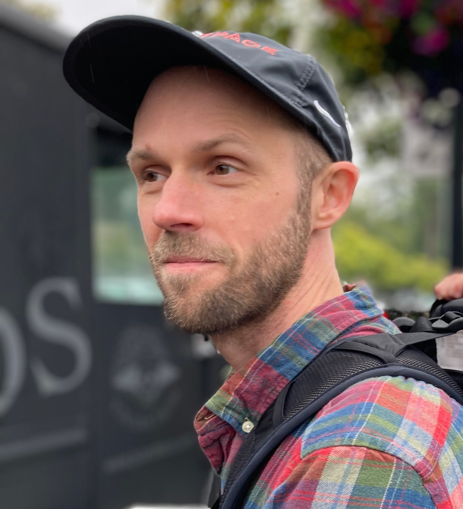

# Paul Sample

  

### About
Computational biologist with a deep interest in generative models for gene regulation, synthetic biology, and understanding the wonders of the genome.  

  
<pjsample [at] gmail [dot] com>
  
### Publications
**Human 5′ UTR Design and Variant Effect Prediction from a Massively Parallel Translation Assay**  
**Paul J Sample**, Ban Wang, David W Reid, Vlad Presnyak, Iain J McFadyen, David R Morris, Georg Seelig  
*Nature Biotechnology, 2019*

**Single-Cell Profiling of the Developing Mouse Brain and Spinal Cord with Split-Pool Barcoding**  
Alexander B Rosenberg, Charles M Roco, Richard A Muscat, Anna Kuchina, **Paul J Sample**, Zizhen Yao, Lucas T Graybuck, David J Peeler, Sumit Mukherjee, Wei Chen, et al.  
*Science, 2018*

**Multimodal Circulating Tumor DNA (ctDNA) Colorectal Neoplasia Detection Assay for Asymptomatic and Early-Stage Colorectal Cancer (CRC)**  
Jeeyun Lee, Hee C Kim, Seung Tae Kim, Yupeng He, **Paul J Sample**, Yoshiaki Nakamura, Victoria M Raymond, Ariel Jaimovich, AmirAli Talasaz  
*Journal of Clinical Oncology 39, 2021*

**Integrated Genomic and Epigenomic Cell-Free DNA (cfDNA) Analysis for the Detection of Early-Stage Colorectal Cancer** 
Oscar Westesson, Haley Axelrod, Jason Dean, Yupeng He, **Paul Sample**, Elena Zotenko, Ruth McCole, Mohit Goel, Charbel Eid, Jessica Kurata, et al.  
*AACR, 2020*

**Multimodal Circulating Tumor DNA (ctDNA) Blood-Based Colorectal Cancer (CRC) Screening Test Demonstrates Clinically Meaningful Sensitivity Across Multiple Clinical Parameters**  
Hee Cheol Kim, Seung Tae Kim, Yupeng He, **Paul J Sample**, Victoria Raymond, Ariel Jaimovich, AmirAli Talasaz, Jeeyun Lee  
*Official journal of the American College of Gastroenterology, 2021*

**A Common tRNA Modification at an Unusual Location: The Discovery of Wyosine Biosynthesis in Mitochondria** 
**Paul J Sample**, Luděk Kořený, Zdeněk Paris, Kirk W Gaston, Mary Anne T Rubio, Ian MC Fleming, Scott Hinger, Eva Horáková, Patrick A Limbach, Julius Lukeš, et al.  
*Nucleic Acids Research, 2015*

**RoboOligo: Software for Mass Spectrometry Data to Support Manual and de Novo Sequencing of Post-Transcriptionally Modified Ribonucleic Acids**  
**Paul J Sample**, Kirk W Gaston, Juan D Alfonzo, Patrick A Limbach  
*Nucleic Acids Research, 2015*

**Unusual Noncanonical Intron Editing Is Important for tRNA Splicing in Trypanosoma Brucei**  
Mary Anne T Rubio, Zdeněk Paris, Kirk W Gaston, Ian MC Fleming, **Paul J Sample**, Christopher R Trotta, Juan D Alfonzo  
*Molecular Cell, 2013*

**tRNA Biogenesis and Processing**  
Jessica L Spears, Mary Anne T Rubio, **Paul J Sample**, Juan D Alfonzo  
*RNA Metabolism in Trypanosomes, 99-121, 2012, Springer*

**The T. Brucei TRM5 Methyltransferase Plays an Essential Role in Mitochondrial Protein Synthesis and Function**  
Zdeněk Paris, Eva Horáková, Mary Anne T Rubio, **Paul J Sample**, Ian MC Fleming, Stephanie Armocida, Julius Lukeš, Juan D Alfonzo  
*RNA, 2013*
